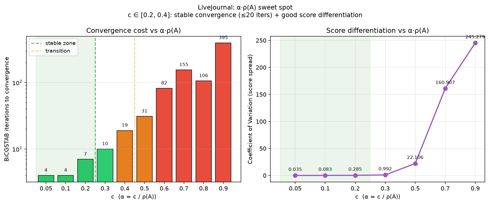
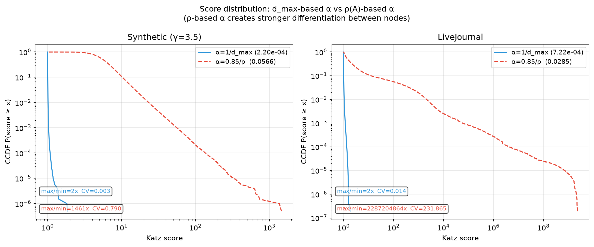

# External memory Katz Centrality

## Выбор метрики

Katz centrality ранжирует вершины по взвешенной сумме всех путей: $(I - \alpha A^\top)x = \mathbf{1}$.
Выбрана вместо PageRank, потому что не требует нормировки по степени — это важно для графов с гипер-узлами, где PageRank занижает влияние хабов. Сводится к линейной системе → эффективные итерационные методы.

**Сложность:** препроцессинг $O(m \log m)$, одна итерация $O(m)$, итого $O(k \cdot m)$, $k = 2\text{–}20$.

## Представление графа

Ключевая операция: SpMV: $y = A^\top x$ (для каждого ребра $\text{src} \to \text{dst}$: $y[\text{dst}] \mathrel{+}= x[\text{src}]$).

**Вариант 1. CSC в RAM** (`col_ptr[n+1]` + `row_idx[m]`).
SpMV параллелен по столбцам без атомиков, 4 B/edge bandwidth. Требует $O(n+m)$ RAM — для LJ (49M рёбер) это 227 MB, не влезает в 128 MB.

**Вариант 2. Streaming (выбран как основной).**
`rev_edges.bin` (отсортирован по $\text{dst}$) читается через mmap. Разбиваем на $T$ чанков по dst-границам → $T$ потоков пишут в непересекающиеся диапазоны $y$, atomics не нужны. RAM $= O(n)$. Гипер-узлы не создают hotspot — каждое ребро стоит одинаково.

Ограничение: скорость ограничена пропускной способностью диска (SSD ~3 GB/s).

## Результаты

Машина: Apple, M3, 8 cores. Датасеты: synthetic ($2\text{M}/30\text{M}$, $\gamma=3.5$), LiveJournal ($5.2\text{M}/49\text{M}$), twitter-synth ($41\text{M}/1.4\text{B}$, $\gamma=2.1$).

### Время на итерацию (8 потоков)

| Dataset | Method | Mode | Time/iter |
|---------|--------|------|-----------|
| Synthetic | BiCGSTAB | CSC | 32 ms |
| LiveJournal | BiCGSTAB | Streaming | 74 ms |
| Twitter-synth | BiCGSTAB | Streaming | 4,804 ms |

LJ ($49\text{M}$ рёбер) $\to$ Twitter-synth ($1.4\text{B}$ рёбер): $28.6\times$ рёбер, $28.6\times$ время - линейное масштабирование.

### Масштабируемость по потокам (LiveJournal, streaming)

| Threads | 1 | 2 | 4 | 8 |
|---------|---|---|---|---|
| Power | 1210 ms | 422 ms | 238 ms | 194 ms ($6.2\times$) |
| BiCGSTAB | 863 ms | 327 ms | 188 ms | 148 ms ($5.8\times$) |

Twitter-synth ($1.4\text{B}$): 8 потоков $\to$ $3.95\times$ (против $6.2\times$ на LJ) — бо́льший граф упирается в пропускную способность SSD.

### Корректность

Сравнение с NumPy reference: Корреляция: $\geq 0.9999999994$, max diff $< 10^{-5}$. ✓

## Выбор $\alpha$

Стандартная практика: $\alpha = 0.85/d_{\max}$. Но $d_{\max}$ завышает спектральный радиус $\rho(A)$ в **250–500×**:

| Dataset | $d_{\max}$ | $\rho(A)$ | $d_{\max}/\rho$ |
|---------|-----------|----------|----------------|
| Synthetic | 3,864 | 15.0 | $257\times$ |
| LiveJournal | 14,933 | 29.8 | $501\times$ |

При $\alpha = 1/d_{\max}$ scores почти одинаковы для всех вершин ($\text{CV} = 0.014$). При $\alpha = 0.3/\rho(A)$:

| $\alpha$ | Iterations | CV | Max score |
|---------|-----------|-----|-----------|
| $1/d_{\max}$ | 2 | 0.014 | 1.9 |
| $0.3/\rho(A)$ | 10 | 0.99 | 159 |

**Рекомендация:** оценить $\rho(A)$ через power method (~10 SpMV), взять $\alpha = 0.3/\rho(A)$ — $70\times$ лучше дифференциация при разумной сходимости.

